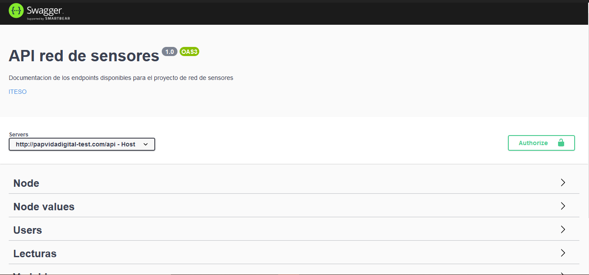
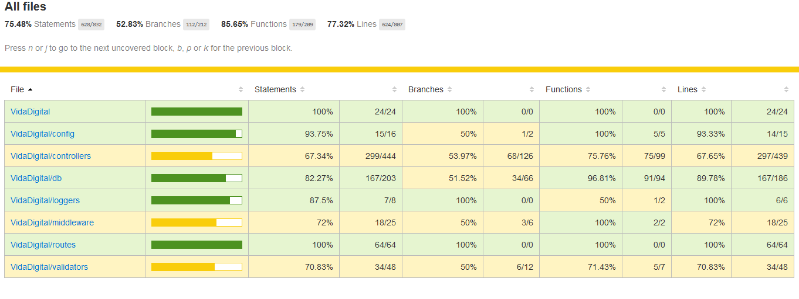
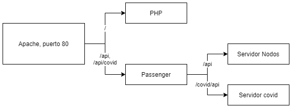

Documentación del código
========================

La documentación del código está hecha con JSDocs, y esta toma los
comentarios de las funciones. Es similar a la sintaxis Javadoc en Java,
pero en este caso es para JS.

JSDocs genera un HTML en donde se puede visualizar de forma amigable.

Para volver a generar la documentación es necesario tener el proyecto
descargado y ejecutar el script "gen-docs" el cual generará una carpeta
llamada "out" en donde se encontrará el archivo HTML.

Documentación en docs/code.md

Diseño del código
=================

Nos apegamos al patrón de diseño MVC (Modelo-Vista-Controlador), pero
haciendo una omisión al componente de Vista, dado que no existe
interacción con el usuario.

El código además esta divido en más carpetas para poder diferenciar de
manera clara la funcionalidad. El código está dividido principalmente en
los siguientes paquetes

-   **Config:** Aquí existen todos los archivos de configuración como la
    obtención de credenciales y la conexión a la base de datos, el
    archivo de definición JSON para Swagger y la encriptación de datos.

-   **Controllers:** Aquí, como su nombre lo indica van todos los
    controladores y por lo tanto las validaciones son llevadas a cabo
    aquí. Además, las pruebas también se encuentran en este paquete y
    estas van sobre su respectivo controlador

-   **Db:** Este paquete es el equivalente al "modelo" del patrón de
    diseño, aquí es en donde se hace la consulta a la base de datos
    necesaria.

-   **Loggers:** Para poder mantener un registro de fácil visualización
    fue necesario crear este paquete y aquí se definen los archivos que
    escriben en los archivos que se dividen en los logs de errores y en
    los logs de lecturas

-   **Middleware:** En este paquete van los middlewares, al momento
    solamente existen 2 que son, 'Auth' y 'Verify'. El primero se
    encarga de verificar que se tenga un JWT en los endpoints que
    necesitan una autentificación. El segundo se encarga es utilizado en
    los endpoints más sensibles en donde solamente lo usan usuarios
    autentificados y que sean administradores

-   **Routes:** Para hacer más fácil el mantenimiento del código se
    decidió a y utilizamos este middleware de Express para manejar de
    manera separada cada ruta.

-   **Validators:** Para poder hacer las validaciones y poder
    reutilizarlas, se pusieron en esta carpeta.

Validaciones por esquema
========================

Es necesario hacer validaciones en métodos de inserción o de
actualización de datos (POST, PUT, PATCH) o incluso con otros métodos,
la forma en que nosotros decidimos realizar la validación de tipos fue
ayudarnos con los modelos ya hechos en Swagger.

Estas validaciones se encuentran en la carpeta validators y se podrán
diferenciar porque llevan el nombre de "validarEsquema" y la forma para
poder validar los recibidos se hace la comparación atributo a atributo
contra el modelo de swagger.

Swagger
=======

Para poder documentar la API decidimos utilizar Swagger, que es una
herramienta que permite entre otras cosas documentar y utilizar
servicios web REST.

Toda la información proviene de un archivo JSON en donde se define las
propiedades de cada elemento y a partir de ese documento se genera una
interfaz que puede ser accesada desde un endpoint definido previamente
en donde se podrá visualizar de manera.

Aquí esta las rutas están agrupadas de acuerdo con el controlador que
pertenece cada una, y dentro se encuentran listadas cada uno de los
endpoints que dispone la aplicación, además dentro de cada petición se
encuentra los elementos que espera recibir y los códigos de respuestas y
la información que regresa la petición.

Para poder editar y visualizar al mismo tiempo sin la necesidad de
ejecutar el proyecto, se puede hacer uso de la herramienta ofrecida por
la misma compañía, en donde se coloca el json o yaml y se puede
visualizar en tiempo real los cambios hechos:
<https://editor.swagger.io/>

Para acceder al archivo generado por swagger que se encuentra en
producción puede ser accesado desde:
<http://papvidadigital-test.com/api/api-docs/nodos/>

Es necesario actualizar manualmente cualquier cambio en el archivo json
para que se pueda ver reflejado en



Contexto de ejecución
=====================

Uno de los problemas que se presentaron al momento de la implementación
del código fue el manejo del pool de conexiones. En ingeniería de
software, un pool de conexiones es una cache de conexiones a una base de
datos para que estas sean mantenidas en futuras peticiones a la base de
datos, de esta forma se mejora el rendimiento al ejecutar consultas en
una base de datos ya que los recursos son adquiridos una sola vez en el
ciclo de vida de la aplicación.

Esta solución tiene como desventaja que se tiene un número limitado de
conexiones simultaneas a la base de datos que se deben de manejar
adecuadamente para mantener los recursos disponibles para todos. Para la
librería utilizada para las conexiones a la base de datos, estas se
tienen que cerrar explícitamente, para facilitar la implementación y
evitar tener código repetido y aumentar la posibilidad de error, se
llegó a una solución que fue llamada "ExecutionContext" la cual usa el
patón de diseño Adapter y Context.

Esta implementación recibe una promesa, preferiblemente dentro de un
closure, y retorna otra promesa.


Ilustración 1. Diagrama para contexto de ejecución.

Con este contexto de ejecución se logra una comunicación entre las
diferentes capas de la aplicación y con el Adapter se modifica el
comportamiento de" ExecutionContext\", logrando así, antes de cada
ejecución de PoolContextCallback se adquiera una conexión y esa se pase
dentro del contexto, al terminar la ejecución de PoolContextCallback se
libera la conexión para ser utilizada en otra petición.

Para mantener un buen diseño y buenas prácticas se obliga a encapsular
la lógica de una consulta en una función, para poder acceder a la
conexión existente en el contexto de ejecución, esta se debe de pasar
como el primer parámetro de la función seguido por los relevantes para
la función. Esta llamada debe de retornar una promesa.


Ilustración 2. Diagrama para función modelo

Un ejemplo de uso toma la función getVariables del controlador
variables. Podemos observar que tanto la función del modelo, la interfaz
PoolContextCallback y el ExectionContext retornan una promesa. Se obliga
a retornar promesas en todos los casos.

```js
async function getVariables(req, res) {
  try {
    await executionContext(async (context) => {
      const { connection } = context;
      const result = await variablesModel.getVariables(connection);
      res.json(result);
    });
  } catch (e) {
    errorLog(e.message);
    res.status(500).send('Internal server error');
  }
}
```

Se obliga al desarrollador a seguir este patrón para evitar posibles
errores y no cerrar una conexión antes de tiempo o nunca ser cerrada.
Esta solución sigue los pasos

1.  Adquisición de recursos

2.  Utilización de recursos

3.  Limpieza o liberación de recursos.

Pruebas
=======

Para realizar las pruebas utilizamos el framework de Jest, el cual
permite hacer pruebas unitarias a cualquier proyecto basado en JS, ese
framework incluye a su vez la dependencia de Istanbul, la cual permite
generar reportes de cobertura de manera visual.

Las pruebas están en el paquete de Controladores puesto que la prueba se
hace hacia el controlador (se hace una prueba a cada endpoint).

Al ejecutar el script "test" se generarán las siguientes carpetas
"coverage\\lcov-report" en donde se econtrara el archivo index HTML. Ese
archivo es un reporte visual de las pruebas hechas, en donde se podrá
observar %Statements, \#Branches, \#Funciones y \#Lineas cubiertas por
cada archivo, de las pruebas escritas.



Integración continua
====================

Hablando desde DevOps, La integración continua es una práctica de
desarrollo de software mediante la cual los desarrolladores combinan los
cambios en el código en un repositorio central de forma periódica, tras
lo cual se ejecutan versiones y pruebas automáticas. La integración
continua se refiere en su mayoría a la fase de creación o integración
del proceso de publicación de software y conlleva un componente de
automatización.

Para lograr la integración continua de los nuevos componentes de
software se realizan dos acciones principales, evaluación de estilo de
código y pruebas al código y estas se ejecutan cada vez que se realiza
un "Pull Request" en la plataforma Azure DevOps. La configuración de las
etapas de integración continua está descrita en el archivo
azure-pipelines.yaml.

Para evaluar el estilo del código se utiliza una herramienta llamad
Linter, para este caso en específico se utiliza el
[ESLint](https://eslint.org/). Esta herramienta cuenta con una extensión
en el editor de código Visual Studio Code. La descripción de las reglas
está descrita en el repo
[JavaScript](https://github.com/airbnb/javascript/blob/master/README.md)
de Airbnb, estas se configuran en el archivo .eslint.

Phusion Passenger
=================

Phusion Passenger es un servidor web gratuito que brinda soporte para
Ruby, Python y NodeJS. Está diseñado para ser integrado con Apache o
Nginx. Está pensado para tener alto rendimiento y eficiencia. Este
servidor empezó a causar problemas al detener el servicio de NodeJS de
forma inesperada con el siguiente error: Checking whether to disconnect
long-running connections for process 21039, application
/home/papvida1/O2020 (production)



Ilustración 3. Captura del error de Passenger

Ese problema se encuentra documentado en el siguiente
[Issue](Documentado%20en%20este%20Issue%20en%20GitHub%20https:/github.com/phusion/passenger/issues/1865)
en GitHub

Esa salida no indica ningún problema, como indica la documentación de
Phusion Passenger, este es un comportamiento esperado después que la
aplicación pasa una cantidad predeterminada de segundos sin actividad,
este termina la aplicación para que no esté utilizando recursos, cuando
se vuelve a necesitar Passenger lo vuelve a levantar.

Para lograr que la aplicación se levante de manera automática no se
encontró una metodología de despliegue adecuada, la única observación
que se tiene es, al momento de subir código nuevo, se requiere detener e
iniciar la aplicación en lugar de solo reiniciar. Esta diferencia puede
ser un problema de CPanel y no de Passenger


Ilustración 4. Diagrama sobre el manejo de peticiones por Apache

Contribuciones y código de conducta
===================================

Para contribuir en este repositorio, favor de pedir acceso vía correo
electrónico a cualquiera de los dos contribuidores originales.

Proceso para integración de código
----------------------------------

1.  Verificar que las dependencias trabajen con la versión 9.11.x de
    Node Js.

2.  Asegurarse que cualquier dependencia necesaria durante las pruebas
    locales es removida

3.  Asegurarse que todas las pruebas de los componentes modificados o
    creados pasen en un entorno local y controlado

4.  Crear un Pull Request (PR) y pedir a alguien más que lo revise con
    la siguiente información

    a.  Título

    b.  Que se cambió

    c.  Por que son importantes estos cambios

    d.  Cambios a futuro/código que faltó integrar.

5.  Atender a los posibles errores en el pipeline

Código de conducta
------------------

### Nuestras plegarias

Para el interés de los pasados, presentes y futuros desarrolladores de
este código, así como del usuario final y las personas que mantienen
funcionando este proyecto, pedimos que se genere un ambiente agradable
durante la participación en este proyecto. Pedimos que en este proyecto
sea construido junto a una comunidad de profesionales con los estándares
profesionales y éticos que se asumen por ser miembro del ITESO,
Universidad Jesuita de Guadalajara.

### Comportamiento esperado

-   Ser respetuoso con todos los participantes

-   Aceptar las críticas constructivas

-   Enfocarse en lo que es bueno para la comunidad

-   Ser empático con los demás

### Responsabilidades

Los desarrolladores de este proyecto son responsables de mantener la
calidad tanto funcional y de codificación. Las buenas prácticas de
programación son obligatorias

La seguridad de los datos no es un juego, los datos se deben de
mantener, seguros y accesibles en todo momento. Las buenas prácticas de
seguridad son obligatorias.

Todos somos responsables de El Bosque de la Primavera, este proyecto nos
hace partícipes de una solución a los problemas del bosque.
